# Entity relationship diagram

_Generated by `scripts/gen-docs.sh` from foreign keys in the migrations. Do not edit by hand._

Lines read "parent ||--o{ child": one parent row, many child rows. Optional links (nullable foreign keys) use `o|`.

```mermaid
erDiagram
  applications o|--o{ onboarding_tasks : "application_id"
  applications ||--o{ application_offers : "application_id"
  applications ||--o{ application_reviews : "application_id"
  applications ||--o{ application_status_history : "application_id"
  approval_requests ||--o{ approval_decisions : "request_id"
  asset_categories ||--o{ assets : "category_id"
  assets o|--o{ tickets : "asset_id"
  assets ||--o{ asset_assignments : "asset_id"
  assets ||--o{ asset_documents : "asset_id"
  assets ||--o{ asset_duplicate_flags : "asset_id"
  assets ||--o{ asset_duplicate_flags : "other_asset_id"
  assets ||--o{ asset_finance_links : "asset_id"
  assets ||--o{ asset_history : "asset_id"
  assets ||--o{ asset_maintenance : "asset_id"
  assets ||--o{ asset_retirements : "asset_id"
  assets ||--o{ asset_warranties : "asset_id"
  bank_accounts ||--o{ payments : "received_account_id"
  billable_items ||--o{ invoice_lines : "billable_item_id"
  client_contacts o|--o{ contract_versions : "contact_id"
  client_contacts o|--o{ invoices : "billing_contact_id"
  client_contacts o|--o{ leads : "contact_id"
  client_contacts o|--o{ quotes : "contact_id"
  client_contacts o|--o{ tickets : "contact_id"
  client_contacts ||--o{ project_contacts : "contact_id"
  clients o|--o{ assets : "client_id"
  clients o|--o{ enquiries : "client_id"
  clients o|--o{ leads : "client_id"
  clients o|--o{ tickets : "client_id"
  clients ||--o{ billable_items : "client_id"
  clients ||--o{ client_contacts : "client_id"
  clients ||--o{ client_distinct_pairs : "client_a"
  clients ||--o{ client_distinct_pairs : "client_b"
  clients ||--o{ client_divisions : "client_id"
  clients ||--o{ client_staff : "client_id"
  clients ||--o{ contracts : "client_id"
  clients ||--o{ enquiry_candidates : "client_id"
  clients ||--o{ invoices : "client_id"
  clients ||--o{ matching_reviews : "left_client_id"
  clients ||--o{ matching_reviews : "right_client_id"
  clients ||--o{ payments : "client_id"
  clients ||--o{ projects : "client_id"
  clients ||--o{ quotes : "client_id"
  contract_lines o|--o{ billable_items : "contract_line_origin_id"
  contract_versions ||--o{ contract_lines : "version_id"
  contracts o|--o{ billable_items : "contract_id"
  contracts o|--o{ invoices : "contract_id"
  contracts ||--o{ contract_projects : "contract_id"
  contracts ||--o{ contract_status_history : "contract_id"
  contracts ||--o{ contract_versions : "contract_id"
  divisions o|--o{ approval_policies : "division_id"
  divisions o|--o{ approval_requests : "division_id"
  divisions o|--o{ clients : "owner_division_id"
  divisions o|--o{ enquiries : "source_division_id"
  divisions o|--o{ positions : "division_id"
  divisions o|--o{ staff : "primary_division_id"
  divisions o|--o{ staff_assignments : "division_id"
  divisions o|--o{ staff_roles : "division_id"
  divisions o|--o{ websites : "division_id"
  divisions ||--o{ asset_assignments : "division_id"
  divisions ||--o{ assets : "division_id"
  divisions ||--o{ billable_items : "division_id"
  divisions ||--o{ client_divisions : "division_id"
  divisions ||--o{ contracts : "division_id"
  divisions ||--o{ enquiries : "division_id"
  divisions ||--o{ invoices : "division_id"
  divisions ||--o{ leads : "division_id"
  divisions ||--o{ project_divisions : "division_id"
  divisions ||--o{ projects : "lead_division_id"
  divisions ||--o{ quotes : "division_id"
  divisions ||--o{ services : "division_id"
  divisions ||--o{ tickets : "division_id"
  divisions ||--o{ vacancies : "division_id"
  enquiries ||--o{ enquiry_candidates : "enquiry_id"
  entity_types ||--o{ entity_registry : "entity_type"
  entity_types ||--o{ id_sequences : "prefix"
  event_subscriptions ||--o{ event_deliveries : "subscription_id"
  events ||--o{ event_deliveries : "event_id"
  invoices o|--o{ asset_finance_links : "invoice_id"
  invoices ||--o{ invoice_lines : "invoice_id"
  invoices ||--o{ payment_allocations : "invoice_id"
  leads o|--o{ enquiries : "lead_id"
  leads o|--o{ quotes : "lead_id"
  milestones o|--o{ tasks : "milestone_id"
  payments o|--o{ asset_finance_links : "payment_id"
  payments ||--o{ payment_allocations : "payment_id"
  payments ||--o{ payment_reversals : "payment_id"
  people o|--o{ enquiries : "person_id"
  people o|--o{ leads : "person_id"
  people o|--o{ staff : "person_id"
  people ||--o{ applications : "person_id"
  people ||--o{ client_contacts : "person_id"
  permissions ||--o{ role_permissions : "permission_id"
  positions o|--o{ staff : "position_id"
  positions o|--o{ staff_assignments : "position_id"
  positions ||--o{ vacancies : "position_id"
  project_services o|--o{ billable_items : "project_service_id"
  projects o|--o{ asset_assignments : "project_id"
  projects o|--o{ assets : "project_id"
  projects o|--o{ billable_items : "project_id"
  projects o|--o{ invoices : "project_id"
  projects o|--o{ quotes : "project_id"
  projects o|--o{ tickets : "project_id"
  projects ||--o{ contract_projects : "project_id"
  projects ||--o{ milestones : "project_id"
  projects ||--o{ portfolio_entries : "project_id"
  projects ||--o{ project_contacts : "project_id"
  projects ||--o{ project_divisions : "project_id"
  projects ||--o{ project_financials : "project_id"
  projects ||--o{ project_members : "project_id"
  projects ||--o{ project_services : "project_id"
  projects ||--o{ tasks : "project_id"
  quote_lines o|--o{ contract_lines : "quote_line_id"
  quote_lines o|--o{ project_services : "quote_line_id"
  quotes o|--o{ contracts : "quote_id"
  quotes ||--o{ quote_lines : "quote_id"
  roles ||--o{ role_permissions : "role_id"
  roles ||--o{ staff_roles : "role_id"
  service_prices o|--o{ billable_items : "price_id"
  service_prices o|--o{ contract_lines : "price_id"
  service_prices o|--o{ invoice_lines : "price_id"
  service_prices o|--o{ project_services : "price_id"
  service_prices o|--o{ quote_lines : "price_id"
  services o|--o{ billable_items : "service_id"
  services o|--o{ contract_lines : "service_id"
  services o|--o{ enquiries : "requested_service_id"
  services o|--o{ invoice_lines : "service_id"
  services o|--o{ leads : "requested_service_id"
  services o|--o{ quote_lines : "service_id"
  services ||--o{ project_services : "service_id"
  services ||--o{ service_prices : "service_id"
  staff o|--o{ application_offers : "offered_by"
  staff o|--o{ application_status_history : "changed_by"
  staff o|--o{ applications : "staff_id"
  staff o|--o{ approval_requests : "decided_by"
  staff o|--o{ approval_requests : "requested_by"
  staff o|--o{ asset_assignments : "assigned_by"
  staff o|--o{ asset_assignments : "ended_by"
  staff o|--o{ asset_assignments : "staff_id"
  staff o|--o{ asset_documents : "added_by"
  staff o|--o{ asset_duplicate_flags : "reviewed_by"
  staff o|--o{ asset_finance_links : "linked_by"
  staff o|--o{ asset_history : "actor_staff_id"
  staff o|--o{ asset_maintenance : "created_by"
  staff o|--o{ asset_maintenance : "performed_by"
  staff o|--o{ asset_retirements : "disposed_by"
  staff o|--o{ asset_retirements : "retired_by"
  staff o|--o{ asset_warranties : "created_by"
  staff o|--o{ assets : "created_by"
  staff o|--o{ billable_items : "created_by"
  staff o|--o{ client_distinct_pairs : "decided_by"
  staff o|--o{ clients : "created_by"
  staff o|--o{ clients : "deleted_by"
  staff o|--o{ contract_projects : "linked_by"
  staff o|--o{ contract_status_history : "actor_staff_id"
  staff o|--o{ contract_versions : "approved_by"
  staff o|--o{ contract_versions : "created_by"
  staff o|--o{ contract_versions : "requested_by"
  staff o|--o{ contracts : "created_by"
  staff o|--o{ contracts : "owner_staff_id"
  staff o|--o{ enquiries : "assigned_staff_id"
  staff o|--o{ enquiries : "created_by"
  staff o|--o{ enquiry_candidates : "decided_by"
  staff o|--o{ finance_settings : "updated_by"
  staff o|--o{ invoices : "approved_by"
  staff o|--o{ invoices : "created_by"
  staff o|--o{ invoices : "issued_by"
  staff o|--o{ invoices : "requested_by"
  staff o|--o{ leads : "assigned_staff_id"
  staff o|--o{ leads : "created_by"
  staff o|--o{ matching_reviews : "resolved_by"
  staff o|--o{ onboarding_tasks : "assignee_id"
  staff o|--o{ payment_allocations : "allocated_by"
  staff o|--o{ payment_allocations : "released_by"
  staff o|--o{ payment_reversals : "decided_by"
  staff o|--o{ payment_reversals : "requested_by"
  staff o|--o{ payments : "reconciled_by"
  staff o|--o{ payments : "recorded_by"
  staff o|--o{ portfolio_entries : "approved_by"
  staff o|--o{ portfolio_entries : "created_by"
  staff o|--o{ project_services : "created_by"
  staff o|--o{ projects : "created_by"
  staff o|--o{ projects : "deleted_by"
  staff o|--o{ quotes : "approved_by"
  staff o|--o{ quotes : "assigned_staff_id"
  staff o|--o{ quotes : "created_by"
  staff o|--o{ quotes : "requested_by"
  staff o|--o{ service_prices : "approved_by"
  staff o|--o{ service_prices : "proposed_by"
  staff o|--o{ services : "approved_by"
  staff o|--o{ services : "created_by"
  staff o|--o{ services : "deleted_by"
  staff o|--o{ staff_profiles : "approved_by"
  staff o|--o{ staff_roles : "granted_by"
  staff o|--o{ suppliers : "created_by"
  staff o|--o{ tasks : "assignee_id"
  staff o|--o{ tasks : "created_by"
  staff o|--o{ tickets : "assignee_staff_id"
  staff o|--o{ tickets : "reporter_staff_id"
  staff o|--o{ vacancies : "approved_by"
  staff o|--o{ vacancies : "created_by"
  staff o|--o{ vacancies : "deleted_by"
  staff o|--o{ vacancies : "requested_by"
  staff ||--o{ application_reviews : "reviewer_id"
  staff ||--o{ approval_decisions : "approver_id"
  staff ||--o{ client_staff : "staff_id"
  staff ||--o{ notifications : "recipient_staff_id"
  staff ||--o{ onboarding_tasks : "staff_id"
  staff ||--o{ project_members : "staff_id"
  staff ||--o{ staff_assignments : "staff_id"
  staff ||--o{ staff_private : "staff_id"
  staff ||--o{ staff_profiles : "staff_id"
  staff ||--o{ staff_roles : "staff_id"
  suppliers o|--o{ asset_maintenance : "vendor_id"
  suppliers o|--o{ asset_warranties : "provider_id"
  suppliers o|--o{ assets : "supplier_id"
  tickets o|--o{ asset_maintenance : "ticket_id"
  vacancies ||--o{ applications : "vacancy_id"
  websites o|--o{ applications : "source_website_id"
  websites o|--o{ enquiries : "source_website_id"
  websites ||--o{ event_subscriptions : "website_id"
```

Not drawn: `staff.user_id -> auth.users` (the login provider), self-references (`divisions.parent_id`, `staff.deleted_by`), and `created_by`/`approved_by`-style audit links to `staff`.
